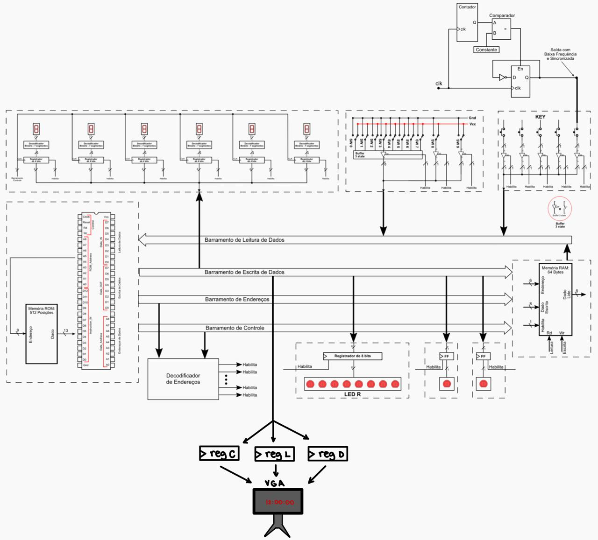
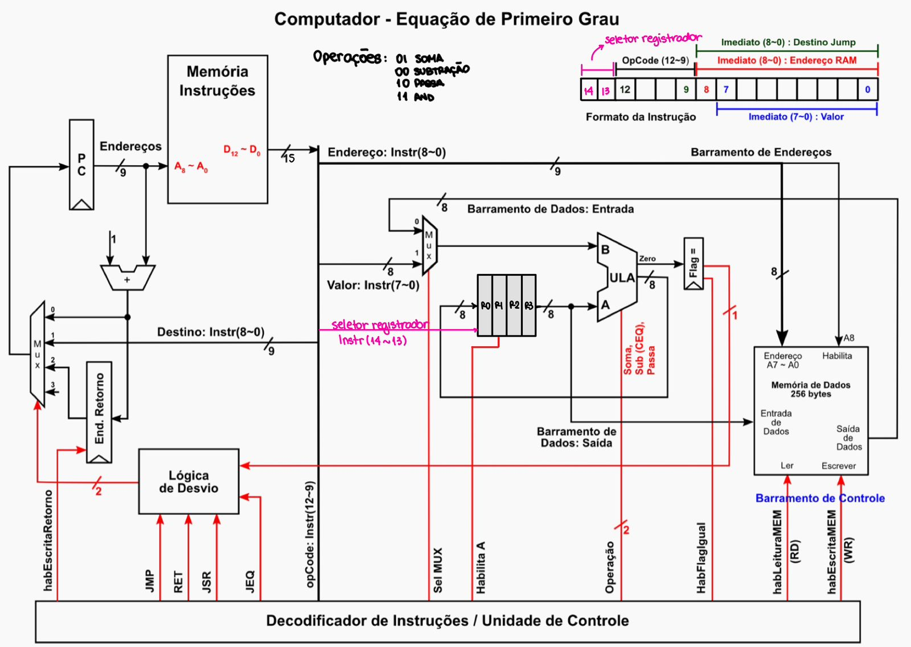
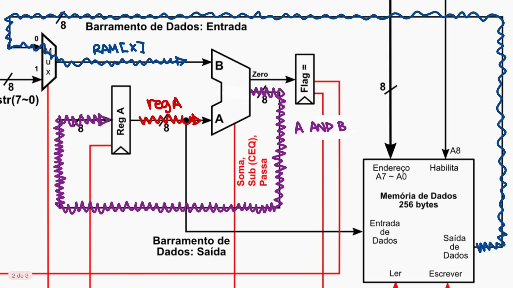
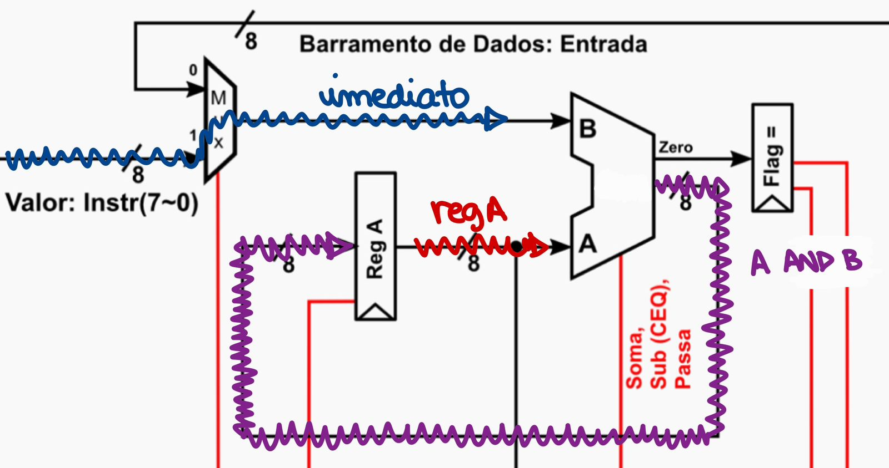
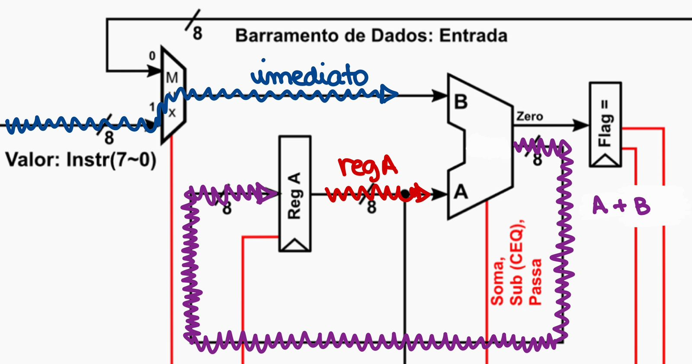
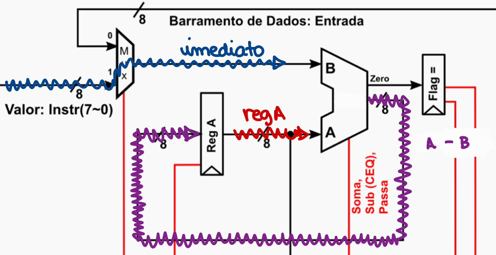
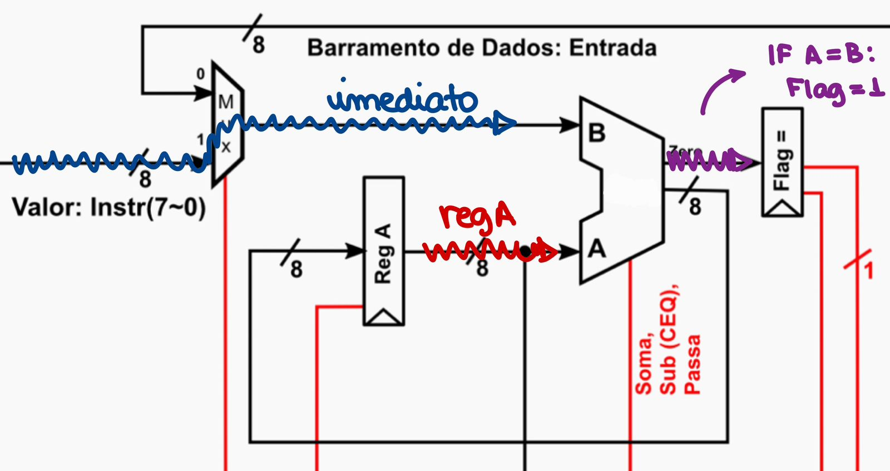

# Projeto de Contador Programado em VHDL

Este projeto consiste em um relógio programado em VHDL que implementa uma CPU simples e sua integração em uma placa FPGA. O objetivo é demonstrar o funcionamento de instruções personalizadas em assembly e a interação com os componentes da placa.

## Diagrama do circuito



### CPU mais detalhada

<div style="text-align: center;">
  
</div>


## Declaração sobre a divisão do trabalho

O projeto foi desenvolvido em parceria por **Breno Schneider** e **Thiago Victoriano**. Ambos trabalharam separadamente na montagem do hardware, optando por utilizar como base o projeto do Thiago, uma vez que ele iniciou as implementações primeiro. O código principal em assembly foi elaborado em conjunto, com divisões básicas dentro de cada função de cada parte do código: para o relógio Thiago e Breno trabalharam juntos no temporizador, Thiago fez o alarme e seleção de horário AM/PM ou 24h e o Breno fez toda a implementação da VGA e a adaptação do decremento do contador para o relógio. O assembler para o contador foi desenvolvido pelo Thiago, entretanto, as mudanças para o relógio foram feitas pelo Breno. As novas funcionalidades do hardware específicas para o projeto foram implementadas pelo Breno, a implemetação da base de tempo em KEY0 e KEY1, assim como a criação de um MUX para selecionar a base de tempo escolhida com base na ativação de uma chave.

## Funcionamento dos botões e chaves

- **SW0 a SW3**: Determinam um horário específico, seja ele para o Alarme ou Temporizador com base no clique de KEY1 ou KEY2.
- **KEY1**: Determina o horário do Alarme.
- **KEY0**: Não possui funcionalidade (o hardware utiliza sua entrada para a base de tempo).
- **KEY2**: Não possui funcionalidade (o hardware utiliza sua entrada para a base de tempo).
- **FPGA_RESET**: Reinicia a contagem.
- **SW9**: Determina se o relógio funcionará no modo AM/PM ou 24 horas.
- **SW6 e SW7**: Aumentam a base de tempo.
- **KEY3**: Determina o inicio do Temporizador.
- **SW4, SW5 e SW8**: Não possuem funcionalidade nesse projeto.

# Novas funções implementadas

#### Foram implementadas as seguintes novas instruções no assembly para o contador:

- **AND**: Realiza a operação lógica AND entre o registrador A e o conteúdo de um endereço de memória especificado.
  - **Sintaxe**: `AND @<endereço>`
  - **Exemplo**: `AND @4` (Realiza o AND entre o registrador e o conteúdo do endereço 4 da memória)



- **ANDi**: Realiza a operação lógica AND entre o registrador A e um valor imediato.
  - **Sintaxe**: `ANDi $<valor_imediato>`
  - **Exemplo**: `ANDi $3` (Realiza o AND entre o registrador e o valor 3)



- **ADDi**: Realiza a soma entre o registrador A e um valor imediato.
  - **Sintaxe**: `ADDi $<valor_imediato>`



- **SUBi**: Realiza a subtração entre o registrador A e um valor imediato.
  - **Sintaxe**: `SUBi $<valor_imediato>`



- **CEQi**: Compara o valor do registrador A com um valor imediato, ativando a flag de igualdade se ambos forem iguais.
  - **Sintaxe**: `CEQi $<valor_imediato>`



#### Nenhuma instrução nova foi implementada para o Relógio.

#### Foi implementado o sistema de Temporizador/Alarme:

- Caso queira implementar um alarme, coloque nas chaves **SW3 até SW0** o valor dos segundos em binário do horário que você deseja, em seguida clique **KEY1**. Você pode perceber que o relógio irá parar até que você termine de determinar o horário do alarme, seguindo a mesma lógica dos segundos até as horas (ou até que todos os leds se apaguem). Em seguida, o alarme estará configurado e, quando o alarme "tocar", o **LED8** irá acender e no monitor conectado com o cabo **VGA** um sino irá aparecer até que você determine um novo alarme ou clique **FPGA_RESET**


- Caso queira implementar um temporizador, coloque nas chaves **SW3 até SW0** o valor dos segundos em binário do horário que você deseja, em seguida clique **KEY3**. Você pode perceber que o relógio irá parar até que você termine de determinar o horário do temporizador, seguindo a mesma lógica dos segundos até as horas (ou até que todos os leds se apaguem). Em seguida, o temporizador estará configurado e já iniciará a contagem regressiva automaticamente, quando chegar em zero ele acendera todos os leds **LED7~LED0** e voltará a funcionar como um relógio comum.

#### Foi implementada a indicação do horário selecionável, com base em 12 horas (AM/PM) ou 24 horas:

- Caso queira que o relógio funcione no modo AM/PM, basta levantar a chave **SW9**, caso contrário, deixe-a abaixada.

## Novos periféricos

#### Foi utilizado o driverVGA:

- Caso queira que o relógio apareça em um monitor, conecte seu monitor na placa **FPGA** através de um **cabo VGA** e pronto, em questão de segundos o relógio deve aparecer na sua tela.

# Código-fonte em Assembly

```assembly
LDI 0, R0		#Carrega o registrador com o valor 0
STA 288, R0		#Armazena o valor do registrador em HEX0
STA 289, R0		#Armazena o valor do registrador em HEX1
STA 290, R0		#Armazena o valor do registrador em HEX2
STA 291, R0		#Armazena o valor do registrador em HEX3
STA 292, R0		#Armazena o valor do registrador em HEX4
STA 293, R0		#Armazena o valor do registrador em HEX5
NOP
LDI 0, R0		#Carrega o registrador com o valor 0
STA 256, R0		#Armazena o valor do bit0 do registrador no LDR0 ~ LEDR7
STA 257, R0		#Armazena o valor do bit0 do registrador no LDR8
STA 258, R0		#Armazena o valor do bit0 do registrador no LDR9
NOP
LDI 0, R0		#Carrega o registrador com o valor 0
STA 0, R0		#Armazena o valor do registrador em MEM[0] (unidades)
STA 1, R0		#Armazena o valor do registrador em MEM[1] (dezenas)
STA 2, R0		#Armazena o valor do registrador em MEM[2] (centenas)
STA 6, R0		#Armazena o valor do registrador em MEM[6] (milhares)
STA 7, R0		#Armazena o valor do registrador em MEM[7] (dezenas de milhares)
STA 8, R0		#Armazena o valor do registrador em MEM[8] (centenas de milhares)
STA 9, R0		#Armazena o valor do registrador em MEM[9] (flag de decremento)
LDI 9, R0		#Carrega o registrador com o valor 9
STA 10, R0		#Armazena o valor do registrador em MEM[10] (inibir unidade)
STA 11, R0		#Armazena o valor do registrador em MEM[11] (inibir dezena)
STA 12, R0		#Armazena o valor do registrador em MEM[12] (inibir centena)
STA 13, R0		#Armazena o valor do registrador em MEM[13] (inibir milhar)
STA 14, R0		#Armazena o valor do registrador em MEM[14] (inibir dezena de milhar)
STA 15, R0		#Armazena o valor do registrador em MEM[15] (inibir centena de milhar)
NOP
STA 511, R0	    	#Limpa a leitura do botão zero
STA 510, R0	    	#Limpa a leitura do botão um
STA 509, R0	    	#Limpa a leitura do botão dois
STA 508, R0	    	#Limpa a leitura do botão tres
NOP
LDI 8, R3    #COLUNA 8
STA 384, R3   #ARMAZENA NO REGISTRADOR DAS COLUNAS
LDI 4, R3     #LINHA 4
STA 385, R3   #ARMAZENA NO REGISTRADOR DAS LINHAS
LDI 58, R3     #dois pontos
STA 386, R3   #ARMAZENA NO REGISTRADOR DA DATA
STA 387, R3   #MANDA PRA VGA
LDI 11, R3    #COLUNA 11
STA 384, R3   #ARMAZENA NO REGISTRADOR DAS COLUNAS
LDI 58, R3     #dois pontos
STA 386, R3   #ARMAZENA NO REGISTRADOR DA DATA
STA 387, R3   #MANDA PRA VGA
INICIO:
NOP
LDA 9, R0	    	#Carrega o registrador com a leitura de MEM[9] (flag de decremento)
CEQi 0, R0		#Compara com constante 0
JEQ FLAG_DESATIVADA	#Desvia se igual a 0 (botão não foi pressionado)
LDA 354, R0	    	#Carrega o registrador com a leitura do botão KEY2
ANDi 1, R0		#Utiliza a máscara b0000_0001 para limpar todos os bits menos o bit 0
CEQi 0, R0		#Compara com constante 0
JEQ NAO_CLICOU0		#Desvia se igual a 0 (botão não foi pressionado)
JSR DECREMENTO		#O botão foi pressionado, chama a sub-rotina de decremento
NOP			#Retorno da sub-rotina de decremento
JMP NAO_CLICOU0
FLAG_DESATIVADA:		
LDA 352, R0  		#Carrega o registrador com a leitura do botão KEY0
ANDi 1, R0		#Utiliza a máscara b0000_0001 para limpar todos os bits menos o bit 0
CEQi 0, R0		#Compara com constante 0
JEQ NAO_CLICOU0		#Desvia se igual a 0 (botão não foi pressionado)
JSR INCREMENTO		#O botão foi pressionado, chama a sub-rotina de incremento
NOP 		    	#Retorno da sub-rotina de incremento
NAO_CLICOU0:
JSR SALVA_DISP  	#Escreve o valor das váriaveis de contagem nos displays
NOP		        #Retorno da sub-rotina de salvar nos displays
LDA 353, R0	    	#Carrega o registrador com a leitura do botão KEY1
ANDi 1, R0		#Utiliza a máscara b0000_0001 para limpar todos os bits menos o bit 0
CEQi 0, R0		#Compara com constante 0
JEQ NAO_CLICOU1		#Desvia se igual a 0 (botão não foi pressionado)
JSR DEFINE_LIM		#O botão foi pressionado, chama a sub-rotina de definir limite
NOP 		    	#Retorno da sub-rotina de definir limite
NAO_CLICOU1:
JSR VERIFICA_LIM
NOP		        #Retorno da sub-rotina de verificar limite
LDA 355, R0	    	#Carrega o registrador com a leitura do botão KEY3
ANDi 1, R0		#Utiliza a máscara b0000_0001 para limpar todos os bits menos o bit 0
CEQi 0, R0		#Compara com constante 0
JEQ NAO_CLICOU2		#Desvia se igual a 0 (botão não foi pressionado)
LDA 1, R0
STA 258, R0		#Armazena o valor do bit0 do registrador no LDR9
JSR TEMPORIZADOR	#O botão foi pressionado, chama a sub-rotina de temporizador
NAO_CLICOU2:
NOP    			#Retorno da sub-rotina de temporizador
LDA 356, R0	    	#Carrega o registrador com a leitura do botão FPGA_RESET
ANDi 1, R0		#Utiliza a máscara b0000_0001 para limpar todos os bits menos o bit 0
CEQi 1, R0		#Compara com constante 1
JEQ REINICIO		#Desvia se igual a 1 (botão não foi pressionado)
JSR RESET	    	#O botão foi pressionado, chama a sub-rotina de reset
REINICIO:
NOP		        #Retorno da sub-rotina de reset
JMP INICIO	   	#Fecha o laço principal, faz uma nova leitura de KEY0
NOP
INCREMENTO:
LDA 322, R2		#Carrega valor de SW9 no registrador 2
STA 258, R2		#Escreve o valor de R2 no LED9
STA 511, R0	    	#Limpa a leitura do botão
LDA 0, R0		#Carrega o valor de MEM[0] (contador)
ADDi 1, R0		#ADDi com a constante 1
CEQi 10, R0		#Compara o valor com constante 10
JEQ VAIUM_D		#Realiza o carry out caso valor igual a 10
STA 0, R0		#Salva o incremento em MEM[0] (contador)
RET			#Retorna da sub-rotina
VAIUM_D:
LDI 0, R0		#Carrega valor 0 no registrador 0
STA 0, R0		#Armazena o valor do registrador em MEM[0] (unidades)
LDA 1, R0		#Carrega valor de MEM[1] no registrador (dezenas)
ADDi 1, R0		#ADDi com a constante 1
CEQi 6, R0		#Compara o valor com constante 10
JEQ VAIUM_C		#Realiza o carry out caso valor igual a 10
STA 1, R0		#Salva o incremento em MEM[1] (dezenas)
RET
VAIUM_C:
LDI 0, R0		#Carrega valor 0 no registrador
STA 1, R0		#Armazena o valor do registrador em MEM[1] (dezenas)
LDA 2, R0		#Carrega valor de MEM[2] no registrador (centenas)
ADDi 1, R0		#ADDi com a constante 1
CEQi 10, R0		#Compara o valor com constante 10
JEQ VAIUM_M		#Realiza o carry out caso valor igual a 10
STA 2, R0		#Salva o incremento em MEM[2] (centenas)
RET
VAIUM_M:
LDI 0, R0		#Carrega valor 0 no registrador 
STA 2, R0		#Armazena o valor do registrador em MEM[2] (centenas)
LDA 6, R0		#Carrega valor de MEM[6] no registrador (milhares)
ADDi 1, R0		#ADDi com a constante 1
CEQi 6, R0		#Compara o valor com constante 10
JEQ VAIUM_DM		#Realiza o carry out caso valor igual a 10
STA 6, R0		#Salva o incremento em MEM[6] (milhares)
RET
VAIUM_DM:
LDI 0, R0		#Carrega valor 0 no registrador
STA 6, R0		#Armazena o valor do registrador em MEM[6] (milhares)
LDA 7, R0		#Carrega valor de MEM[7] no registrador (dezenas de milhares)
ADDi 1, R0		#ADDi com a constante 1
LDA 8, R1		#Carrega valor de MEM[8] no registrador (centenas de milhares)
LDA 322, R2		#Carrega valor de SW9 no registrador 2
CEQi 0, R2		#Compara o valor do R2 com constante 0 (verifica se a chave am pm esta ligada)
JEQ 24HORAS
12HORAS:
CEQi 1, R1		#Compara o valor com constante 1
JEQ COMPARA3		#Pula para o fim da rotina
CEQi 10, R0		#Compara o valor com constante 10
JEQ VAIUM_CM2		#Realiza o carry out caso valor igual a 10
JMP END_DM
COMPARA3:
CEQi 3, R0		#Compara o valor com constante 3
JEQ VAIUM_CM2		#Realiza o carry out caso valor igual a 3
END_DM:
STA 7, R0		#Salva o incremento em MEM[7] (dezenas de milhares)
RET
VAIUM_CM2:
LDI 0, R0		#Carrega valor 0 no registrador 
STA 7, R0		#Armazena o valor do registrador em MEM[7] (dezenas milhares)
LDA 8, R0		#Carrega valor de MEM[8] no registrador (centenas de milhares)
ADDi 1, R0		#ADDi com a constante 1
CEQi 2, R0		#Compara o valor com constante 3
JEQ ZERA_HEX_AM		#Zera se chegar ao final
STA 8, R0		#Salva o incremento em MEM[8] (centena de milhares)
RET
24HORAS:
CEQi 2, R1		#Compara o valor com constante 2
JEQ COMPARA4		#Pula para o fim da rotina
CEQi 10, R0		#Compara o valor com constante 10
JEQ VAIUM_CM		#Realiza o carry out caso valor igual a 10
JMP END_DM
COMPARA4:
CEQi 4, R0		#Compara o valor com constante 4
JEQ VAIUM_CM		#Realiza o carry out caso valor igual a 4
END_DM:
STA 7, R0		#Salva o incremento em MEM[7] (dezenas de milhares)
RET
VAIUM_CM:
LDI 0, R0		#Carrega valor 0 no registrador 
STA 7, R0		#Armazena o valor do registrador em MEM[7] (dezenas milhares)
LDA 8, R0		#Carrega valor de MEM[8] no registrador (centenas de milhares)
ADDi 1, R0		#ADDi com a constante 1
CEQi 3, R0		#Compara o valor com constante 3
JEQ ZERA_HEX		#Zera se chegar ao final
STA 8, R0		#Salva o incremento em MEM[8] (centena de milhares)
RET
SALVA_DISP:
NOP
LDI 13, R3    #COLUNA 13
STA 384, R3   #ARMAZENA NO REGISTRADOR DAS COLUNAS
LDI 4, R3     #LINHA 4
STA 385, R3   #ARMAZENA NO REGISTRADOR DAS LINHAS
LDA 0, R3 		#Carrega o valor de MEM[0] (unidades)
STA 288, R3 	#Armazena valor do registrador de unidades no HEX0
ADDi 48, R3   #ACERTA COM O VALOR NO DO NUMERO NO .MIF
STA 386, R3   #ARMAZENA NO REGISTRADOR DA DATA
STA 387, R3   #MANDA PRA VGA
NOP
LDI 12, R3    #COLUNA 12
STA 384, R3   #ARMAZENA NO REGISTRADOR DAS COLUNAS
LDA 1, R3 		#Carrega o valor de MEM[1] (dezenas)
STA 289, R3 	#Armazena valor do registrador de dezenas no HEX1
ADDi 48, R3   #ACERTA COM O VALOR NO DO NUMERO NO .MIF
STA 386, R3   #ARMAZENA NO REGISTRADOR DA DATA
STA 387, R3   #MANDA PRA VGA
NOP
LDI 10, R3    #COLUNA 10
STA 384, R3   #ARMAZENA NO REGISTRADOR DAS COLUNAS
LDA 2, R3 		#Carrega o valor de MEM[2] (centenas)
STA 290, R3 	#Armazena valor do registrador de centenas no HEX2
ADDi 48, R3   #ACERTA COM O VALOR NO DO NUMERO NO .MIF
STA 386, R3   #ARMAZENA NO REGISTRADOR DA DATA
STA 387, R3   #MANDA PRA VGA
NOP
LDI 9, R3    #COLUNA 9
STA 384, R3   #ARMAZENA NO REGISTRADOR DAS COLUNAS
LDA 6, R3 		#Carrega o valor de MEM[6] (milhares)
STA 291, R3 	#Armazena valor do registrador de unidades no HEX3
ADDi 48, R3   #ACERTA COM O VALOR NO DO NUMERO NO .MIF
STA 386, R3   #ARMAZENA NO REGISTRADOR DA DATA
STA 387, R3   #MANDA PRA VGA
NOP
LDI 7, R3    #COLUNA 7
STA 384, R3   #ARMAZENA NO REGISTRADOR DAS COLUNAS
LDA 7, R3 		#Carrega o valor de MEM[7] (dezenas de milhares)
STA 292, R3 	#Armazena valor do registrador de dezenas no HEX4
ADDi 48, R3   #ACERTA COM O VALOR NO DO NUMERO NO .MIF
STA 386, R3   #ARMAZENA NO REGISTRADOR DA DATA
STA 387, R3   #MANDA PRA VGA
NOP
LDI 6, R3    #COLUNA 6
STA 384, R3   #ARMAZENA NO REGISTRADOR DAS COLUNAS
LDA 8, R3 		#Carrega o valor de MEM[8] (centenas de milhares)
STA 293, R3 	#Armazena valor do registrador de centenas no HEX5
ADDi 48, R3   #ACERTA COM O VALOR NO DO NUMERO NO .MIF
STA 386, R3   #ARMAZENA NO REGISTRADOR DA DATA
STA 387, R3   #MANDA PRA VGA
RET
RESET:
LDI 0, R0		#Carrega o registrador com o valor 0
STA 0, R0	 	#Armazena o valor do registrador na MEM[0] (unidades)
STA 1, R0	 	#Armazena o valor do registrador na MEM[1] (dezenas)
STA 2, R0	 	#Armazena o valor do registrador na MEM[2] (centenas)
STA 6, R0	 	#Armazena o valor do registrador na MEM[6] (milhar)
STA 7, R0	 	#Armazena o valor do registrador na MEM[7] (dezena de milhar)
STA 8, R0	 	#Armazena o valor do registrador na MEM[8] (centena de milhar)
STA 9, R0	 	#Armazena o valor do registrador na MEM[9] (flag de decremento)
STA 257, R0		#Armazena o valor do bit0 do registrador no LDR8
LDI 9, R0		#Carrega o registrador com o valor 9
STA 10, R0		#Armazena o valor do registrador em MEM[10] (inibir unidade)
STA 11, R0		#Armazena o valor do registrador em MEM[11] (inibir dezena)
STA 12, R0		#Armazena o valor do registrador em MEM[12] (inibir centena)
STA 13, R0		#Armazena o valor do registrador em MEM[13] (inibir milhar)
STA 14, R0		#Armazena o valor do registrador em MEM[14] (inibir dezena de milhar)
STA 15, R0		#Armazena o valor do registrador em MEM[15] (inibir centena de milhar)
LDI 10, R3    #COLUNA 10
STA 384, R3   #ARMAZENA NO REGISTRADOR DAS COLUNAS
LDI 6, R3     #LINHA 6
STA 385, R3   #ARMAZENA NO REGISTRADOR DAS LINHAS
LDI 0, R3     #zera o sino
STA 386, R3   #ARMAZENA NO REGISTRADOR DA DATA
STA 387, R3   #MANDA PRA VGA
RET
VERIFICA_LIM:
LDA 0, R0		#Carrega o valor de MEM[0] (unidades)
CEQ 10, R0		#Compara o valor de MEM[10] (inibir unidade)
JEQ NEXT_LIM1
RET
NEXT_LIM1:
LDA 1, R0		#Carrega o valor de MEM[1] (dezenas)
CEQ 11, R0		#Compara o valor de MEM[11] (inibir dezenas)
JEQ NEXT_LIM2
RET
NEXT_LIM2:
LDA 2, R0		#Carrega o valor de MEM[2] (centenas)
CEQ 12, R0		#Compara o valor de MEM[12] (inibir centenas)
JEQ NEXT_LIM3
RET
NEXT_LIM3:
LDA 6, R0		#Carrega o valor de MEM[6] (milhar)
CEQ 13, R0		#Compara o valor de MEM[13] (inibir milhar)
JEQ NEXT_LIM4
RET
NEXT_LIM4:
LDA 7, R0		#Carrega o valor de MEM[7] (dezena de milhar)
CEQ 14, R0		#Compara o valor de MEM[10] (inibir dezena de milhar)
JEQ NEXT_LIM5
RET
NEXT_LIM5:
LDA 8, R0		#Carrega o valor de MEM[8] (centena de milhar)
CEQ 15, R0		#Compara o valor de MEM[10] (inibir centena de milhar)
JEQ TODOS_IGUAL
RET
TODOS_IGUAL:
LDI 1, R0		#Carrega o registrador com o valor 1
STA 257, R0		#Armazena o valor do bit0 do registrador no LDR8
LDI 10, R3    #COLUNA 10
STA 384, R3   #ARMAZENA NO REGISTRADOR DAS COLUNAS
LDI 6, R3     #LINHA 6
STA 385, R3   #ARMAZENA NO REGISTRADOR DAS LINHAS
LDI 31, R3    #sino
STA 386, R3   #ARMAZENA NO REGISTRADOR DA DATA
STA 387, R3   #MANDA PRA VGA
RET
DEFINE_LIM:
LDI 10, R3    #COLUNA 10
STA 384, R3   #ARMAZENA NO REGISTRADOR DAS COLUNAS
LDI 6, R3     #LINHA 6
STA 385, R3   #ARMAZENA NO REGISTRADOR DAS LINHAS
LDI 0, R3     #zera o sino
STA 386, R3   #ARMAZENA NO REGISTRADOR DA DATA
STA 387, R3   #MANDA PRA VGA
LDI 0, R0		#Carrega o registrador com o valor 0
STA 257, R0		#Armazena o valor do bit0 do registrador no LDR8
STA 510, R0		#Limpa a leitura do botão um
LDA 320, R0		#Carrega o registrador com a leitura do SW7TO0
STA 10, R0		#Armazena o valor do registrador em MEM[10] (inibir unidade)
LDI 4, R0		#Carrega o registrador com o valor 4
STA 256, R0		#Armazena o valor do bit0 do registrador no LDR0 ~ LEDR7
AGUARDA_D:
LDA 353, R0		#Carrega o registrador com a leitura do botão KEY1
ANDi 1, R0		#Utiliza a máscara b0000_0001 para limpar todos os bits menos o bit 0
CEQi 0, R0		#Compara com constante 0
JEQ AGUARDA_D		#Desvia se igual a 0 (botão não foi pressionado)
STA 510, R0		#Limpa a leitura do botão um
LDA 320, R0		#Carrega o registrador com a leitura do SW7TO0
STA 11, R0		#Armazena o valor do registrador em MEM[11] (inibir dezena)
LDI 16, R0		#Carrega o registrador com o valor 16
STA 256, R0		#Armazena o valor do bit0 do registrador no LDR0 ~ LEDR7
AGUARDA_C:
LDA 353, R0		#Carrega o registrador com a leitura do botão KEY1
ANDi 1, R0		#Utiliza a máscara b0000_0001 para limpar todos os bits menos o bit 0
CEQi 0, R0		#Compara com constante 0
JEQ AGUARDA_C		#Desvia se igual a 0 (botão não foi pressionado)
STA 510, R0		#Limpa a leitura do botão um
LDA 320, R0		#Carrega o registrador com a leitura do SW7TO0
STA 12, R0		#Armazena o valor do registrador em MEM[12] (inibir centena)
LDI 32, R0		#Carrega o registrador com o valor 32
STA 256, R0		#Armazena o valor do bit0 do registrador no LDR0 ~ LEDR7
AGUARDA_M:
LDA 353, R0		#Carrega o registrador com a leitura do botão KEY1
ANDi 1, R0		#Utiliza a máscara b0000_0001 para limpar todos os bits menos o bit 0
CEQi 0, R0		#Compara com constante 0
JEQ AGUARDA_M		#Desvia se igual a 0 (botão não foi pressionado)
STA 510, R0		#Limpa a leitura do botão um
LDA 320, R0		#Carrega o registrador com a leitura do SW7TO0
STA 13, R0		#Armazena o valor do registrador em MEM[13] (inibir milhar)
LDI 128, R0		#Carrega o registrador com o valor 128
STA 256, R0		#Armazena o valor do bit0 do registrador no LDR0 ~ LEDR7
AGUARDA_DM:
LDA 353, R0		#Carrega o registrador com a leitura do botão KEY1
ANDi 1, R0		#Utiliza a máscara b0000_0001 para limpar todos os bits menos o bit 0
CEQi 0, R0		#Compara com constante 0
JEQ AGUARDA_DM		#Desvia se igual a 0 (botão não foi pressionado)
STA 510, R0		#Limpa a leitura do botão um
LDA 320, R0		#Carrega o registrador com a leitura do SW7TO0
STA 14, R0		#Armazena o valor do registrador em MEM[13] (inibir dezena de milhar)
LDI 0, R0		#Carrega o registrador com o valor 0
STA 256, R0		#Armazena o valor do bit0 do registrador no LDR0 ~ LEDR7
LDI 1, R0		#Carrega o registrador com o valor 1
STA 258, R0		#Armazena o valor do bit0 do registrador no LDR9
AGUARDA_CM:
LDA 353, R0		#Carrega o registrador com a leitura do botão KEY1
ANDi 1, R0		#Utiliza a máscara b0000_0001 para limpar todos os bits menos o bit 0
CEQi 0, R0		#Compara com constante 0
JEQ AGUARDA_CM		#Desvia se igual a 0 (botão não foi pressionado)
STA 510, R0		#Limpa a leitura do botão um
LDA 320, R0		#Carrega o registrador com a leitura do SW7TO0
STA 15, R0		#Armazena o valor do registrador em MEM[15] (inibir centena de milhar)
LDI 0, R0		#Carrega o registrador com o valor 0
STA 258, R0		#Armazena o valor do bit0 do registrador no LDR9
RET
DECREMENTO:
LDI 0, R0		#Carrega 0 para o registrador
STA 257, R0		#Armazena o valor do bit0 do registrador no LDR8
STA 509, R0		#Limpa a leitura do botão KEY2
LDA 0, R0         	#Carrega MEM[0] (unidades) no registrador
CEQi 0, R0       	#Verifica se MEM[0] == 0
JEQ VEMUM_D   	 	#Se MEM[0] == 0, realiza o "empréstimo"  
SUBi 1, R0        	#Subtrai 1 de MEM[0]
STA 0, R0          	#Armazena o novo valor de MEM[0]
RET             	#Retorna da sub-rotina
VEMUM_D:
LDI 9, R0          	#Carrega 9 no registrador
STA 0, R0          	#Define MEM[0] para 9
LDA 1, R0          	#Carrega MEM[1] (dezenas) no registrador
CEQi 0, R0         	#Verifica se MEM[1] == 0
JEQ VEMUM_C    		#Se MEM[1] == 0, realiza o próximo "empréstimo"
SUBi 1, R0         	#Subtrai 1 de MEM[1]
STA 1, R0          	#Armazena o novo valor de MEM[1]
RET             	#Retorna da sub-rotina
VEMUM_C:
LDI 5, R0          	#Carrega 5 no registrador
STA 1, R0          	#Define MEM[1] para 5
LDA 2, R0          	#Carrega MEM[2] (centenas) no registrador
CEQi 0, R0         	#Verifica se MEM[2] == 0
JEQ VEMUM_M    		#Se MEM[2] == 0, realiza o próximo "empréstimo"
SUBi 1, R0         	#Subtrai 1 de MEM[2]
STA 2, R0          	#Armazena o novo valor de MEM[2]
RET             	#Retorna da sub-rotina
VEMUM_M:
LDI 9, R0          	#Carrega 9 no registrador
STA 2, R0          	#Define MEM[2] para 9
LDA 6, R0          	#Carrega MEM[3] (milhares) no registrador
CEQi 0, R0        	#Verifica se MEM[3] == 0
JEQ VEMUM_DM   		#Se MEM[3] == 0, realiza o próximo "empréstimo"
SUBi 1, R0         	#Subtrai 1 de MEM[3]
STA 6, R0          	#Armazena o novo valor de MEM[3]
RET             	#Retorna da sub-rotina
VEMUM_DM:
LDI 5, R0          	#Carrega 5 no registrador
STA 6, R0         	#Define MEM[3] para 5
LDA 7, R0          	#Carrega MEM[4] (dezenas de milhares) no registrador
CEQi 0, R0         	#Verifica se MEM[4] == 0
JEQ VEMUM_CM   		#Se MEM[4] == 0, realiza o próximo "empréstimo"
SUBi 1, R0         	#Subtrai 1 de MEM[4]
STA 7, R0          	#Armazena o novo valor de MEM[4]
RET             	#Retorna da sub-rotina
VEMUM_CM:
LDI 9, R0          	#Carrega 9 no registrador
STA 7, R0          	#Define MEM[4] para 9
LDA 8, R0          	#Carrega MEM[5] (centenas de milhares) no registrador
CEQi 0, R0         	#Verifica se MEM[5] == 0
JEQ ZERA_HEX		#Zera se for igual a 0
SUBi 1, R0         	#Subtrai 1 de MEM[5]
STA 8, R0          	#Armazena o novo valor de MEM[5]
RET             	#Retorna da sub-rotina
ZERA_HEX:
LDI 0, R0		#Carrega o registrador com o valor 0
STA 258, R0		#Armazena o valor do bit0 do registrador no LDR9
STA 0, R0	 	#Armazena o valor do registrador na MEM[0] (unidades)
STA 1, R0	 	#Armazena o valor do registrador na MEM[1] (dezenas)
STA 2, R0	 	#Armazena o valor do registrador na MEM[2] (centenas)
STA 6, R0	 	#Armazena o valor do registrador na MEM[6] (milhar)
STA 7, R0	 	#Armazena o valor do registrador na MEM[7] (dezena de milhar)
STA 8, R0	 	#Armazena o valor do registrador na MEM[8] (centena de milhar)
STA 9, R0	 	#Armazena o valor do registrador na MEM[9] (flag de decremento)
RET
ZERA_HEX_AM:
LDI 0, R0		#Carrega o registrador com o valor 0
STA 0, R0	 	#Armazena o valor do registrador na MEM[0] (unidades)
STA 1, R0	 	#Armazena o valor do registrador na MEM[1] (dezenas)
STA 2, R0	 	#Armazena o valor do registrador na MEM[2] (centenas)
STA 6, R0	 	#Armazena o valor do registrador na MEM[6] (milhar)
STA 8, R0	 	#Armazena o valor do registrador na MEM[8] (centena de milhar)
LDI 1, R0		#Carrega o registrador com o valor 1
STA 7, R0	 	#Armazena o valor do registrador na MEM[7] (dezena de milhar)
RET
TEMPORIZADOR:
STA 508, R0		#Limpa a leitura do botão tres
LDA 320, R0		#Carrega o registrador com a leitura do SW7TO0
STA 0, R0		#Armazena o valor do registrador em MEM[0] (unidade)
LDI 4, R0		#Carrega o registrador com o valor 4
STA 256, R0		#Armazena o valor do bit0 do registrador no LDR0 ~ LEDR7
AGUARDA_DT:
LDA 355, R0		#Carrega o registrador com a leitura do botão KEY3
ANDi 1, R0		#Utiliza a máscara b0000_0001 para limpar todos os bits menos o bit 0
CEQi 0, R0		#Compara com constante 0
JEQ AGUARDA_DT		#Desvia se igual a 0 (botão não foi pressionado)
STA 508, R0		#Limpa a leitura do botão tres
LDA 320, R0		#Carrega o registrador com a leitura do SW7TO0
STA 1, R0		#Armazena o valor do registrador em MEM[1] (dezena)
LDI 16, R0		#Carrega o registrador com o valor 16
STA 256, R0		#Armazena o valor do bit0 do registrador no LDR0 ~ LEDR7
AGUARDA_CT:
LDA 355, R0		#Carrega o registrador com a leitura do botão KEY3
ANDi 1, R0		#Utiliza a máscara b0000_0001 para limpar todos os bits menos o bit 0
CEQi 0, R0		#Compara com constante 0
JEQ AGUARDA_CT		#Desvia se igual a 0 (botão não foi pressionado)
STA 508, R0		#Limpa a leitura do botão tres
LDA 320, R0		#Carrega o registrador com a leitura do SW7TO0
STA 2, R0		#Armazena o valor do registrador em MEM[2] (centena)
LDI 32, R0		#Carrega o registrador com o valor 32
STA 256, R0		#Armazena o valor do bit0 do registrador no LDR0 ~ LEDR7
AGUARDA_MT:
LDA 355, R0		#Carrega o registrador com a leitura do botão KEY3
ANDi 1, R0		#Utiliza a máscara b0000_0001 para limpar todos os bits menos o bit 0
CEQi 0, R0		#Compara com constante 0
JEQ AGUARDA_MT		#Desvia se igual a 0 (botão não foi pressionado)
STA 508, R0		#Limpa a leitura do botão tres
LDA 320, R0		#Carrega o registrador com a leitura do SW7TO0
STA 6, R0		#Armazena o valor do registrador em MEM[13] (inibir milhar)
LDI 128, R0		#Carrega o registrador com o valor 128
STA 256, R0		#Armazena o valor do bit0 do registrador no LDR0 ~ LEDR7
AGUARDA_DMT:
LDA 355, R0		#Carrega o registrador com a leitura do botão KEY3
ANDi 1, R0		#Utiliza a máscara b0000_0001 para limpar todos os bits menos o bit 0
CEQi 0, R0		#Compara com constante 0
JEQ AGUARDA_DMT		#Desvia se igual a 0 (botão não foi pressionado)
STA 508, R0		#Limpa a leitura do botão tres
LDA 320, R0		#Carrega o registrador com a leitura do SW7TO0
STA 7, R0		#Armazena o valor do registrador em MEM[7] (dezena de milhar)
LDI 0, R0		#Carrega o registrador com o valor 0
STA 256, R0		#Armazena o valor do bit0 do registrador no LDR0 ~ LEDR7
LDI 1, R0		#Carrega o registrador com o valor 1
STA 258, R0		#Armazena o valor do bit0 do registrador no LDR9
AGUARDA_CMT:
LDA 355, R0		#Carrega o registrador com a leitura do botão KEY3
ANDi 1, R0		#Utiliza a máscara b0000_0001 para limpar todos os bits menos o bit 0
CEQi 0, R0		#Compara com constante 0
JEQ AGUARDA_CMT		#Desvia se igual a 0 (botão não foi pressionado)
STA 508, R0		#Limpa a leitura do botão tres
LDA 320, R0		#Carrega o registrador com a leitura do SW7TO0
STA 8, R0		#Armazena o valor do registrador em MEM[8] (centena de milhar)
LDI 0, R0		#Carrega o registrador com o valor 0
STA 258, R0		#Armazena o valor do bit0 do registrador no LDR9
LDI 1, R0		#Carrega o registrador com o valor 1
STA 9, R0		#Armazena o valor do registrador no MEM[9] (flag de decremento)
RET
```
    

## GitHub do Projeto

Para mais detalhes e acesso ao código completo, visite o repositório no GitHub:

[GitHub - Projeto Contador VHDL](https://github.com/brnoschsaloli/descomp_projeto1)

---